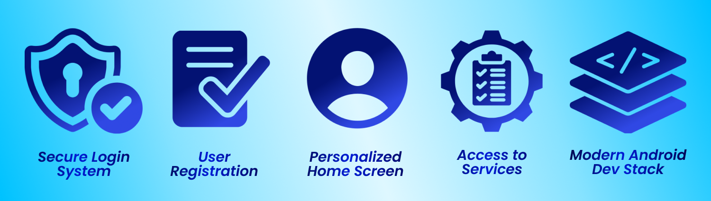

<p align="center">
   
</p>

# 📱 MOBILE ACICSTANCE 📱

**Mobile aCICStance** is the official mobile platform of the **ACICSTANCe Corner** initiative of the CICS Student Council – Alangilan. Designed to bring the corner’s academic and wellness support services directly to students, the app allows CICS learners to conveniently access essential assistance anytime and anywhere.

Developed using **Kotlin**, **Jetpack Compose**, and modern **Android development** practices, the app integrates *Firebase Authentication* and *Firestore/Realtime Database* to ensure a secure, streamlined, and user-friendly experience.

## 🗂️ **Repository Index**
&nbsp;&nbsp;&nbsp;&nbsp; ⚙️ [**Features**](#features)  
&nbsp;&nbsp;&nbsp;&nbsp; ⚙️ [**Tech Stack**](#tech-stack)  
&nbsp;&nbsp;&nbsp;&nbsp; ⚙️ [**Installation Guide**](#installation-guide)  
&nbsp;&nbsp;&nbsp;&nbsp; ⚙️ [**Project Structure**](#project-structure)  
&nbsp;&nbsp;&nbsp;&nbsp; ⚙️ [**Architecture**](#architecture)  
&nbsp;&nbsp;&nbsp;&nbsp; ⚙️ [**Project Developers**](#project-developers)  
&nbsp;&nbsp;&nbsp;&nbsp; ⚙️ [**Acknowledgement**](#acknowledgement)
<br>

## <a id="features"> 🤖 Features</a>
This mobile application delivers the core functionalities required for the Mobile Computing final project while extending the real services of the ACICSTANCe Corner into a digital platform. Built with Kotlin, Firebase, and modern Android development practices, the app provides a secure, efficient, and user-friendly experience for CICS students. 

**Below is a breakdown of the primary features implemented in the system:**
<p align="center">
   
</p>

| **Feature** | **Description** |
|------------|-----------------|
| **Secure Login System** | Login using Email + Password via Firebase Authentication, complete with input validation and error handling to ensure safe and seamless access. |
| **User Registration** | Create an account using Firebase Authentication. Additional details (Full Name, Email, Password, and optional Age/Contact) are stored in Firestore or Realtime Database. |
| **Personalized Home Screen** | Displays the app title **ACICSTANCe Corner**, shows the logged-in user’s name fetched from Firebase, and includes navigation buttons to service pages. |
| **Access to ACICSTANCe Corner Services** | Offers quick access to digital versions of ACICSTANCe services such as printing assistance, school supply requests, academic resources, and wellness support. (Adjust based on your actual implementation.) |
| **Modern Android Development Stack** | Built using Jetpack Compose, MVVM architecture, and modern Android libraries for a clean, efficient, and responsive mobile experience. |


## <a id="tech-stack"> 🤖 Tech Stack </a>
This application is built using modern Android development tools and libraries. It leverages Kotlin, Jetpack Compose, MVVM architecture, and Firebase services to provide a secure, responsive, and user-friendly experience

| Category               | Tools / Libraries                               |
|------------------------|------------------------------------------------|
| ⚙️**Core**               | Kotlin, Min SDK 24, Target SDK 34             |
| ⚙️**Architecture**       | MVVM, Hilt                                    |
| ⚙️**Jetpack Libraries**  | Jetpack Compose, Navigation for Compose, ViewModel, LiveData / Flow |
|⚙️**Firebase Integration** | Firebase Authentication, Cloud Firestore / Realtime Database |
| ⚙️**Async**              | Kotlin Coroutines                              |


## <a id="installation-guide"> 🤖 Installation Guide </a>
### 🛠️ Prerequisites
**Before you begin, ensure you have the following installed:**
- [Android Studio](https://developer.android.com/studio) (Latest stable version)
- JDK 17 or higher
- Android SDK with API level 34
- Gradle 8.0+

---

### 🛠️ Installation

1. **Clone the repository**
   ```bash
   git clone https://github.com/JohnAlcaraz02/MobileCOmputing.git
   cd MobileCOmputing
   ```

2. **Open in Android Studio**
   - Launch Android Studio
   - Select "Open an Existing Project"
   - Navigate to the cloned directory
   - Wait for Gradle sync to complete

3. **Configure API keys (if applicable)**
   - Create a `local.properties` file in the root directory
   - Add your API keys:
     ```properties
     API_KEY=your_api_key_here
     BASE_URL=your_base_url_here
     ```

4. **Build the project**
   ```bash
   ./gradlew build
   ```

5. **Run the app**
   - Connect an Android device or start an emulator
   - Click the "Run" button in Android Studio or use:
     ```bash
     ./gradlew installDebug
     ```
---

**Additional Reminder:** *Once the app is installed and running, you can log in or register to start exploring all the features of Mobile ACICSTANCe. Make sure your Firebase configuration is correct to fully access the app’s services.*


## <a id="project-structure"> 🤖 Project Structure </a>
```
MobileComputing/
├── .github/
│ └── workflows/
│ └── android.yml # CI/CD workflows
├── .gradle/ # Gradle cache (gitignored)
├── app/
│ ├── build/ # Build outputs (gitignored)
│ ├── src/
│ │ ├── main/
│ │ │ ├── java/com/yourcompany/mobilecomputing/
│ │ │ │ ├── MainActivity.kt
│ │ │ │ ├── data/
│ │ │ │ │ ├── local/
│ │ │ │ │ │ ├── database/
│ │ │ │ │ │ │ ├── AppDatabase.kt
│ │ │ │ │ │ │ └── dao/
│ │ │ │ │ │ │ └── UserDao.kt
│ │ │ │ │ │ └── preferences/
│ │ │ │ │ │ └── PreferencesManager.kt
│ │ │ │ │ ├── remote/
│ │ │ │ │ │ ├── api/
│ │ │ │ │ │ │ └── ApiService.kt
│ │ │ │ │ │ └── dto/
│ │ │ │ │ │ └── ResponseDto.kt
│ │ │ │ │ ├── repository/
│ │ │ │ │ │ └── UserRepository.kt
│ │ │ │ │ └── models/
│ │ │ │ │ └── User.kt
│ │ │ │ ├── di/
│ │ │ │ │ ├── AppModule.kt
│ │ │ │ │ └── NetworkModule.kt
│ │ │ │ ├── ui/
│ │ │ │ │ ├── theme/
│ │ │ │ │ │ ├── Color.kt
│ │ │ │ │ │ ├── Theme.kt
│ │ │ │ │ │ └── Type.kt
│ │ │ │ │ ├── components/
│ │ │ │ │ │ └── CustomButton.kt
│ │ │ │ │ ├── screens/
│ │ │ │ │ │ ├── home/
│ │ │ │ │ │ │ ├── HomeScreen.kt
│ │ │ │ │ │ │ └── HomeViewModel.kt
│ │ │ │ │ │ ├── profile/
│ │ │ │ │ │ │ ├── ProfileScreen.kt
│ │ │ │ │ │ │ └── ProfileViewModel.kt
│ │ │ │ │ │ └── auth/
│ │ │ │ │ │ ├── LoginScreen.kt
│ │ │ │ │ │ └── LoginViewModel.kt
│ │ │ │ │ └── navigation/
│ │ │ │ │ └── NavGraph.kt
│ │ │ │ ├── utils/
│ │ │ │ │ ├── Constants.kt
│ │ │ │ │ ├── Extensions.kt
│ │ │ │ │ └── NetworkUtils.kt
│ │ │ │ └── MyApplication.kt
│ │ │ ├── res/
│ │ │ │ ├── drawable/ # Images and vector graphics
│ │ │ │ ├── layout/ # XML layouts (if not using Compose)
│ │ │ │ ├── mipmap-*/ # App icons
│ │ │ │ ├── values/
│ │ │ │ │ ├── colors.xml
│ │ │ │ │ ├── strings.xml
│ │ │ │ │ ├── themes.xml
│ │ │ │ │ └── dimens.xml
│ │ │ │ └── xml/
│ │ │ │ └── network_security_config.xml
│ │ │ └── AndroidManifest.xml
│ │ ├── test/
│ │ │ └── java/com/yourcompany/mobilecomputing/
│ │ │ └── ExampleUnitTest.kt
│ │ └── androidTest/
│ │ └── java/com/yourcompany/mobilecomputing/
│ │ └── ExampleInstrumentedTest.kt
│ ├── build.gradle.kts # App-level build configuration
│ └── proguard-rules.pro # ProGuard rules
├── gradle/
│ └── wrapper/
│ ├── gradle-wrapper.jar
│ └── gradle-wrapper.properties
├── .gitignore
├── build.gradle.kts # Project-level build configuration
├── settings.gradle.kts
├── gradle.properties
├── gradlew
├── gradlew.bat
├── local.properties # Local config (gitignored)
└── README.md
```
---
The structure above outlines the organization of the MobileComputing project. It shows the main directories, source code, resources, and configuration files, providing a clear overview of how the app is structured for development and maintenance.

<br>

## <a id="architecture"> 🤖 Architecture </a>

This project follows **Clean Architecture** principles with clear separation of concerns:

### 🗂️ Layers

1. **Presentation Layer** (`ui/`) 📲
   - Composable screens
   - ViewModels
   - UI state management

2. **Domain Layer** (Business logic) 📲
   - Use cases
   - Business models
   - Repository interfaces

3. **Data Layer** (`data/`) 📲
   - Repository implementations
   - Local data sources (Room)
   - Remote data sources (Retrofit)
   - Data models

### 📤 Data Flow
```
UI (Compose) → ViewModel → Repository → Data Source (Local/Remote)
```

## <a id="project-developers"> 🤖 Project Developers </a>
<p align="center">
   
</p>

### 👩‍💻 Meet the Developers
---
The Mobile aCICStance application was developed by third-year Computer Science students of CS-3101 at Batangas State University – The National Engineering University (BatStateU-TNEU), Alangilan Campus, as part of the CS312: Mobile Computing course. The project aimed to extend the services of the ACICSTANCe Corner into a mobile platform, providing students with convenient access to academic and wellness support anytime, anywhere.

**For further information or inquiries, below are the contact details of the developers:**
| **Name**            | **Gmail**                | **GitHub**               |
|---------------------|--------------------------|--------------------------|
| **John C. Alcaraz**    | 23-07302@g.bastate-u.edu.ph     | [GitHub Profile](https://github.com/JohnAlcaraz02) |
| **Anthonina Dhapniella C. Vael**   | 23-04485@g.batstate-u.edu.ph     | [GitHub Profile](https://github.com/andavael) |

<br>

## <a id="acknowledgement"> 🤖 Acknowledgemnet </a>

We would like to express our gratitude to the [Android Developers Documentation](https://developer.android.com/) and [Jetpack Compose Samples](https://github.com/android/compose-samples) for their comprehensive guides and examples. We also extend our thanks to our course instructor, **Mr. Joshua Fronda**, for his guidance throughout the project, and to the open source community for providing valuable tools, libraries, and support that made this project possible. 📱✨

---
